# Microsoft Entra Cloud Sync Hybrid Identity Lab

Hands-on hybrid identity lab using **Microsoft Entra Cloud Sync** to synchronize identities from **on-premises Active Directory Domain Services (AD DS)** to **Microsoft Entra ID** and validate a complete **Joiner, Mover, and Leaver (JML)** identity lifecycle.

---

## Project Overview

This lab demonstrates an end-to-end hybrid identity synchronization workflow between an on-premises Active Directory environment and Microsoft Entra ID.

The project focused on:

- Installing and configuring the Microsoft Entra Provisioning Agent
- Connecting the `gcyber.test` Active Directory domain
- Using a dedicated security group to control synchronization scope
- Validating a test identity before enabling continuous synchronization
- Demonstrating Joiner, Mover, and Leaver lifecycle behavior
- Verifying lifecycle changes through source state, target state, and provisioning logs

---

## Architecture

```text
On-Premises Active Directory
        gcyber.test
             |
             v
Microsoft Entra Provisioning Agent
             |
             v
Microsoft Entra Cloud Sync
             |
             v
Microsoft Entra ID
```

### Pilot Scope

```text
GG_CloudSync_Pilot
        |
        v
Selected test identities only
```

A pilot security group was used instead of synchronizing all directory objects, allowing controlled testing with a limited blast radius.

---

## Lab Environment

| Component | Configuration |
|---|---|
| Hypervisor | VMware Workstation |
| Domain Controller | DC01 |
| Server OS | Windows Server 2025 |
| AD Domain | `gcyber.test` |
| Identity Platform | Microsoft Entra ID |
| Synchronization | Microsoft Entra Cloud Sync |
| Provisioning Agent | Microsoft Entra Provisioning Agent |
| Pilot Scope Group | `GG_CloudSync_Pilot` |
| Test Identity | Mia Santos |
| PowerShell Module | ActiveDirectory |

---

# Evidence Walkthrough

## 01 — Microsoft Entra Provisioning Agent Configuration

The Microsoft Entra Provisioning Agent was installed and configured to connect the on-premises Active Directory environment to Microsoft Entra ID.

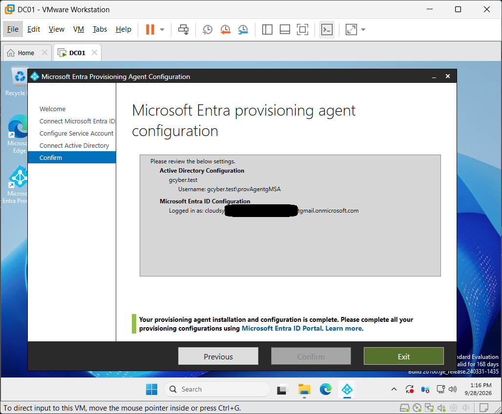

---

## 02 — Cloud Sync Agent Active

The registered Cloud Sync agent was verified as **Active**, confirming that the provisioning agent was successfully communicating with Microsoft Entra.

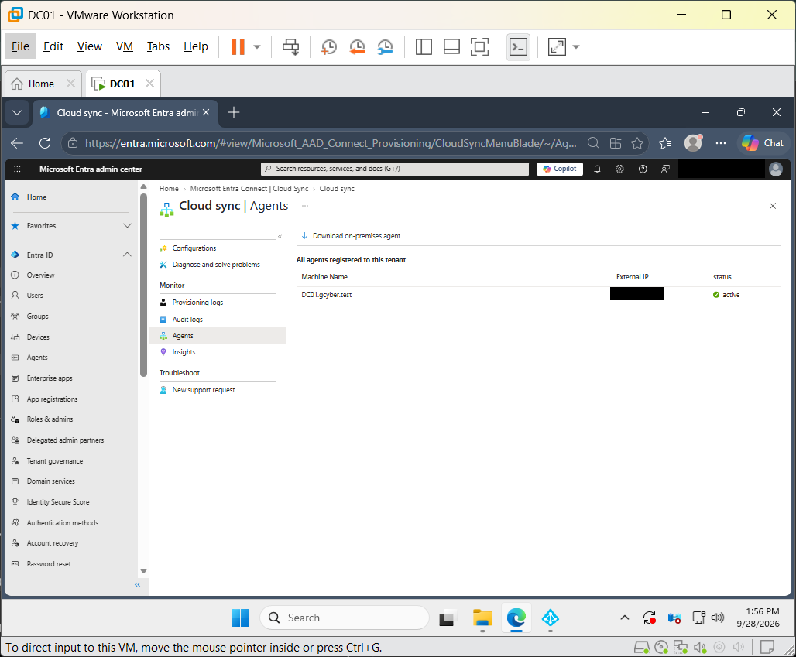

---

## 03 — Pilot Security Group Scope Saved

Synchronization was restricted to the dedicated pilot security group:

`GG_CloudSync_Pilot`

This allowed controlled testing without synchronizing the entire directory.

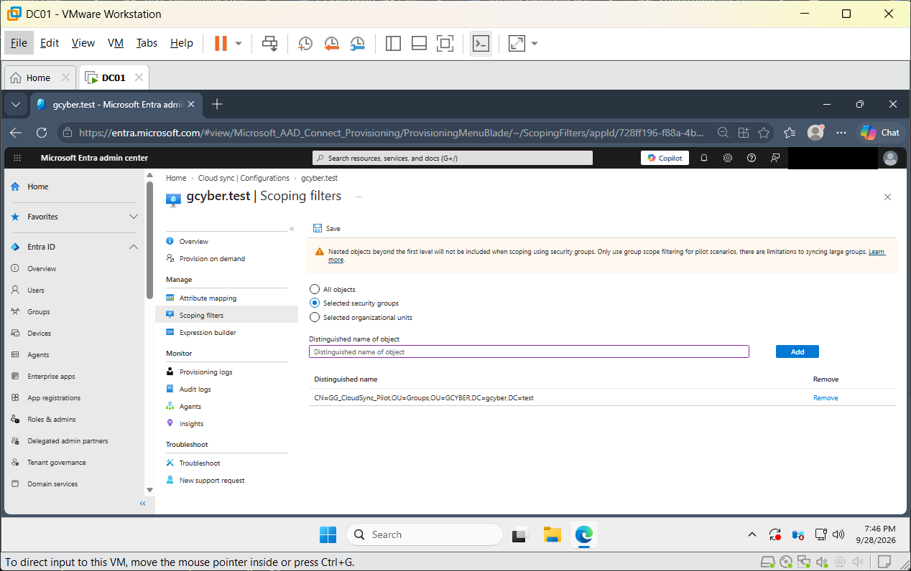

---

# Joiner Lifecycle

## 04 — Provision on Demand Success

Before enabling continuous synchronization, **Mia Santos** was tested using **Provision on demand**.

Cloud Sync successfully:

- Imported the Active Directory object
- Confirmed that the object was in scope
- Matched the source and target identity
- Created the identity in Microsoft Entra ID

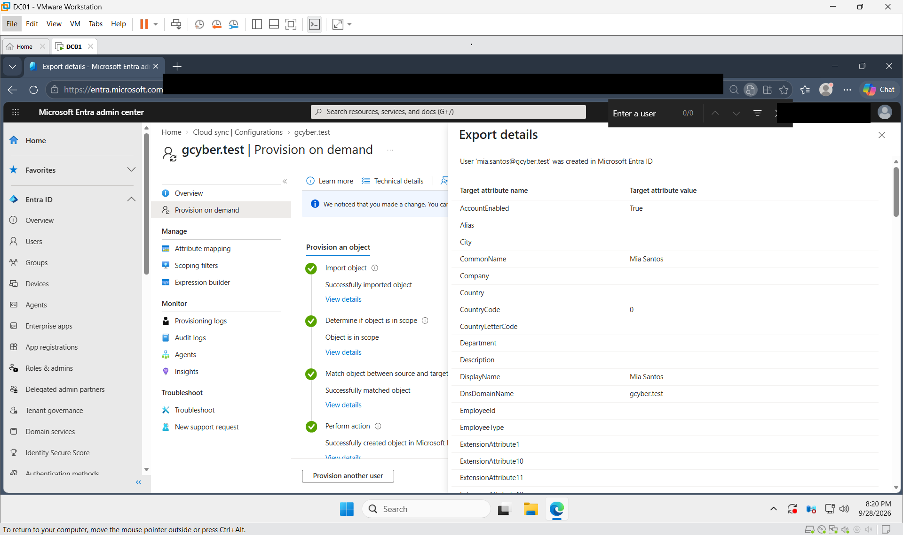

---

## 05 — Hybrid Identity Properties Verified

The resulting Entra identity retained synchronized on-premises identity information including:

- On-premises synchronization status
- Active Directory distinguished name
- SAM account name
- On-premises user principal name
- On-premises domain

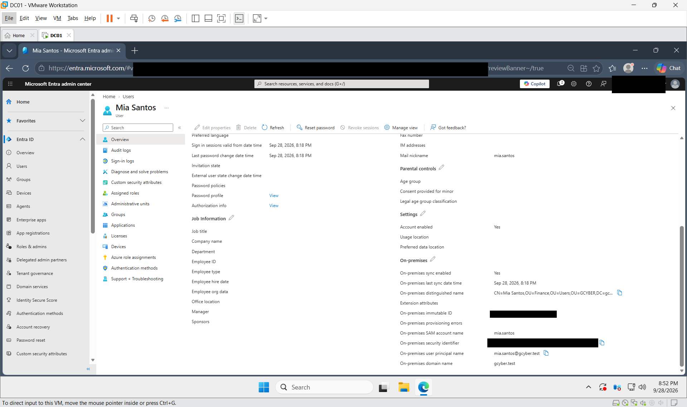

---

## 06 — Continuous Cloud Sync Enabled

After successful pilot validation, the Cloud Sync configuration was enabled for ongoing synchronization.

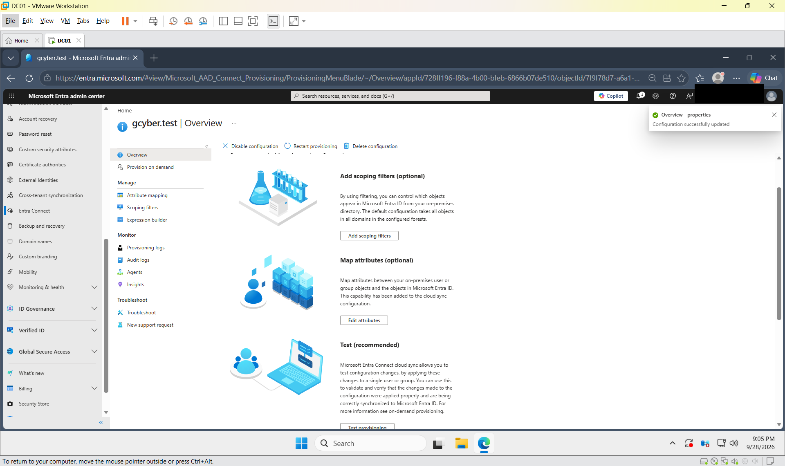

### Joiner Result

```text
Active Directory
      |
      v
Cloud Sync
      |
      v
CREATE
      |
      v
Microsoft Entra ID
      |
      v
SUCCESS
```

---

# Mover Lifecycle

## 07 — Active Directory Department Changed to Sales

A controlled source-side attribute change was performed using PowerShell.

The `Department` attribute for Mia Santos was changed to:

```text
Sales
```

The source-side value was then verified.

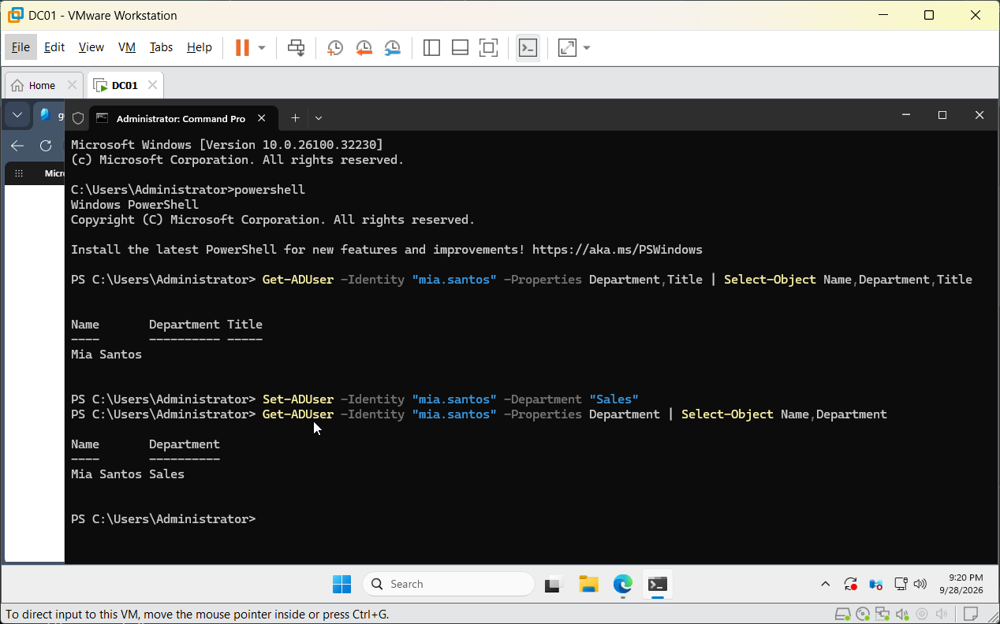

---

## 08 — Entra Department Automatically Updated

Microsoft Entra ID later reflected the same synchronized value:

```text
Department = Sales
```

This confirmed that the source-side attribute change propagated automatically through Cloud Sync.

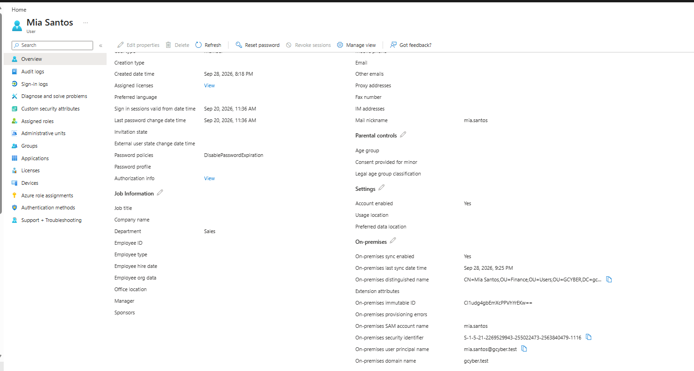

---

## 09 — Provisioning Log Update Success

The provisioning logs confirmed the Mover operation:

```text
Action: Update
Source: Active Directory
Target: Microsoft Entra ID
Status: Success
```

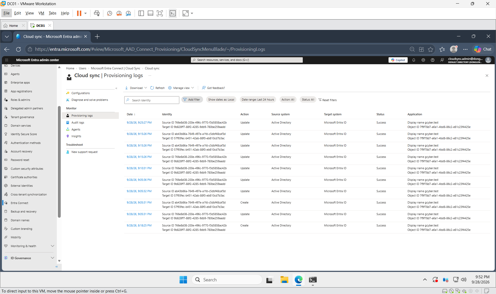

### Mover Result

```text
AD Department
     blank
       |
       v
Changed to Sales
       |
       v
Cloud Sync
       |
       v
UPDATE
       |
       v
Entra Department = Sales
       |
       v
SUCCESS
```

---

# Leaver Lifecycle

## 10 — Pilot Group Membership Removed

For the Leaver test, Mia Santos was removed from the `GG_CloudSync_Pilot` security group.

The membership state was explicitly verified as:

```text
DirectMember = False
```

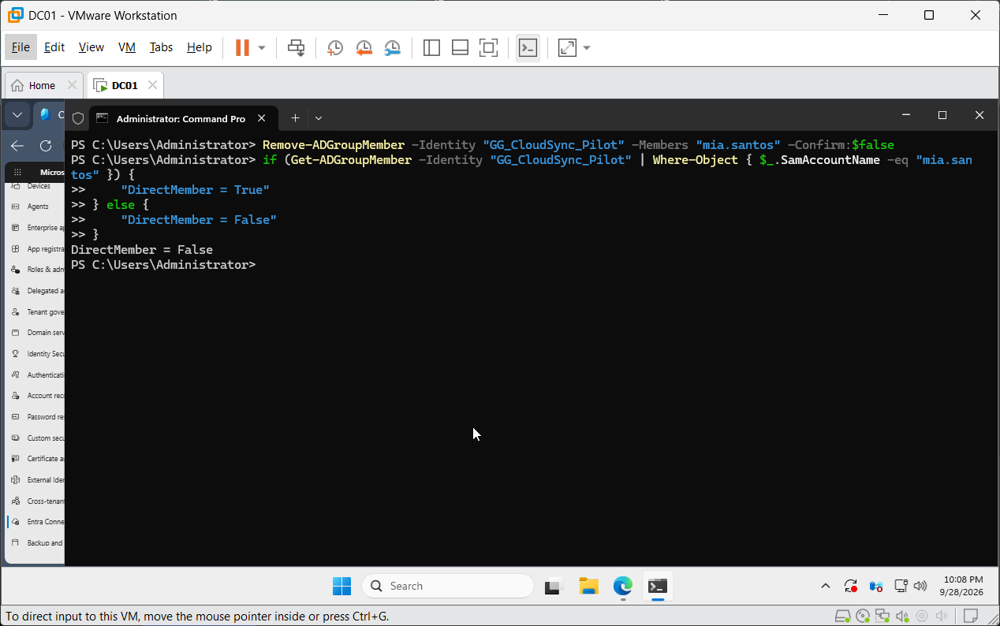

---

## 11 — Provisioning Log Delete Success

Cloud Sync detected that the identity had fallen outside the configured synchronization scope.

The provisioning logs recorded:

```text
Action: Delete
Source: Active Directory
Target: Microsoft Entra ID
Status: Success
```

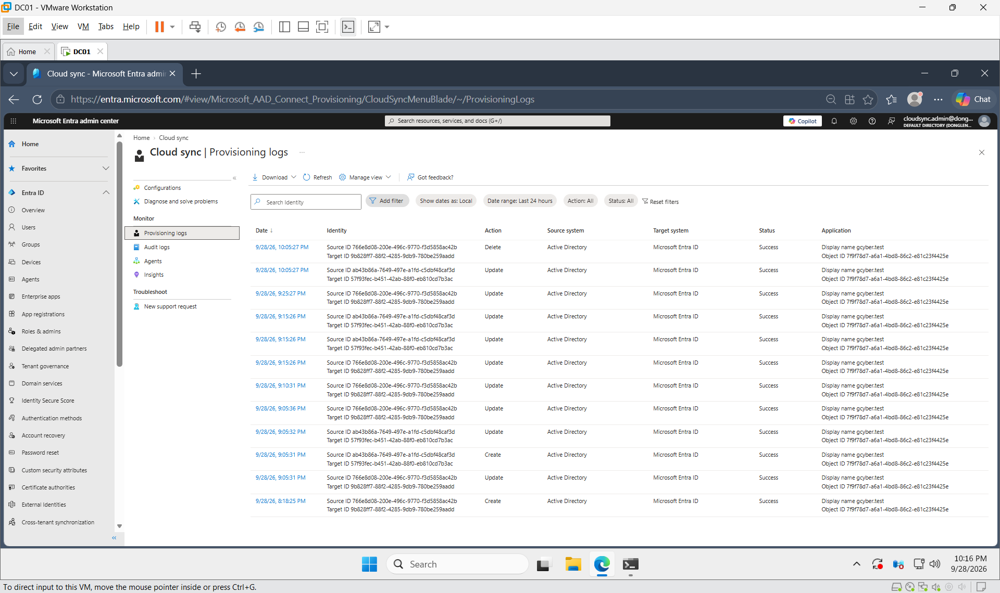

---

## 12 — Recoverable Deleted User Verified

After the successful Delete operation, Mia Santos was no longer present in the active Entra user list.

The identity appeared under **Deleted users**, confirming that it entered a recoverable deleted-user state.

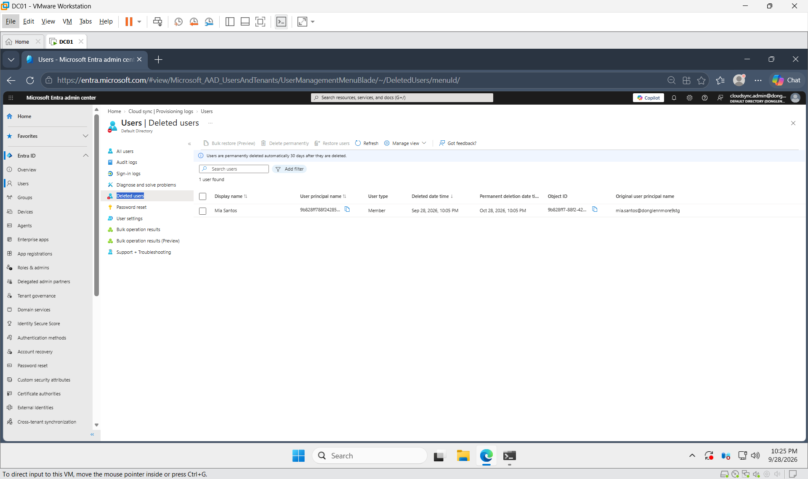

### Leaver Result

```text
Mia Santos
     |
     v
Removed from Pilot Group
     |
     v
Outside Cloud Sync Scope
     |
     v
DELETE
     |
     v
Removed from Active Entra Users
     |
     v
Recoverable Deleted User
```

---

# Lifecycle Validation Summary

| Lifecycle Stage | Source Action | Cloud Sync Action | Target Result |
|---|---|---|---|
| Joiner | User included in pilot scope | Create | Entra identity created |
| Mover | Department changed to `Sales` | Update | Entra attribute updated |
| Leaver | User removed from pilot scope | Delete | Entra identity soft-deleted |

### End-to-End Flow

```text
JOINER
AD -> Cloud Sync -> Create -> Entra ID -> Success

MOVER
AD Change -> Cloud Sync -> Update -> Entra ID -> Success

LEAVER
Scope Removal -> Cloud Sync -> Delete -> Deleted Users -> Success
```

---

# Verification Method

Each lifecycle stage was validated using three evidence layers:

```text
Source State
     |
     v
Synchronization / Provisioning Log
     |
     v
Target State
```

This approach helped distinguish between:

1. A successful source-side change
2. Cloud Sync processing
3. The resulting state in Microsoft Entra ID

The lab therefore validated actual lifecycle outcomes instead of relying only on configuration screens.

---

# Security and Operational Practices

- Used a dedicated pilot security group instead of synchronizing all directory objects
- Tested one identity before enabling continuous synchronization
- Verified source state before validating target state
- Used provisioning logs to confirm automated operations
- Limited lifecycle changes to a dedicated lab identity
- Restored temporary Windows Server security settings after configuration
- Reviewed screenshots before publication and removed or redacted unnecessary sensitive identifiers

---

# PowerShell Used

```powershell
Get-ADUser
Set-ADUser
Get-ADGroupMember
Remove-ADGroupMember
```

These commands were used to inspect identity state, perform controlled attribute changes, and validate group membership throughout the lifecycle tests.

---

# Skills Demonstrated

- Microsoft Entra ID
- Microsoft Entra Cloud Sync
- Hybrid Identity
- Active Directory Domain Services
- Identity and Access Management
- Identity Lifecycle Management
- Joiner / Mover / Leaver Workflows
- Identity Provisioning
- Identity Deprovisioning
- Security Group Scoping
- Attribute Synchronization
- Provisioning Log Analysis
- PowerShell
- IAM Troubleshooting
- Source-to-Target Validation
- Controlled Change Management

---

# Key Takeaways

This lab demonstrated that hybrid identity synchronization involves more than simply creating a cloud account.

A reliable identity lifecycle requires validation across:

1. Authoritative source
2. Synchronization scope
3. Attribute mappings
4. Provisioning processing
5. Target identity state
6. Deprovisioning behavior
7. Recovery state

The primary operational pattern reinforced throughout this project was:

```text
Verify Source -> Observe Processing -> Verify Target
```

---

## Lab Disclaimer

This repository documents a **personal hands-on lab environment** created for IAM and hybrid identity learning.

All identities, domains, users, groups, and configurations shown are lab/test resources and are not presented as a production deployment.
